# Advanced Physical Design using OpenLANE/Sky130

repository for openlane workshop performing full RTL to GDSII flow using openlane with the Google-SkyWater’s open source 130nm process design kit (pdk) during the VSD Advanced Physical Design workshop.
OpenLANE is an automated RTL to GDSII flow based on the OpenROAD, Yosys, Magic, OpenSTA, Fault, TritonRoute, SPEF-Extractor. OpenLANE  adjust for  Skywater 130nm open-source PDK.

<!-- PROJECT LOGO -->
<br />
<p align="center">

  

  <h3 align="center">Advanced Physical Design - OpenLANE Workshop</h3>
</p>

<!-- GETTING STARTED -->
## Getting Started

### Prerequisites

  1. Ubuntu OS-based System (preferred ) or windows 8/10 system with virtual box 
  2. 30GB+ Disk Space

### Installation
[A complete guide to install open-source EDA tools](https://www.udemy.com/share/101skKAEESeVZUR3QF/) OR https://github.com/kunalg123/vsdflow for installation of vsdflow  
[A complete guide to install OpenLANE and Sky130nm PDK](https://www.udemy.com/share/103wqAAEESeVZUR3QF/) or https://github.com/nickson-jose/openlane_build_script for installation of openlane

<!-- Day 1 Inception of Open Source EDA -->
## Day 1 Inception of Open Source EDA
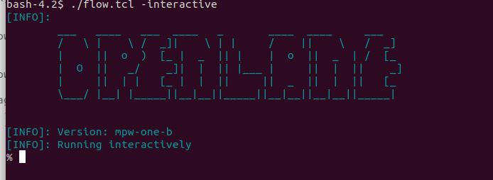  
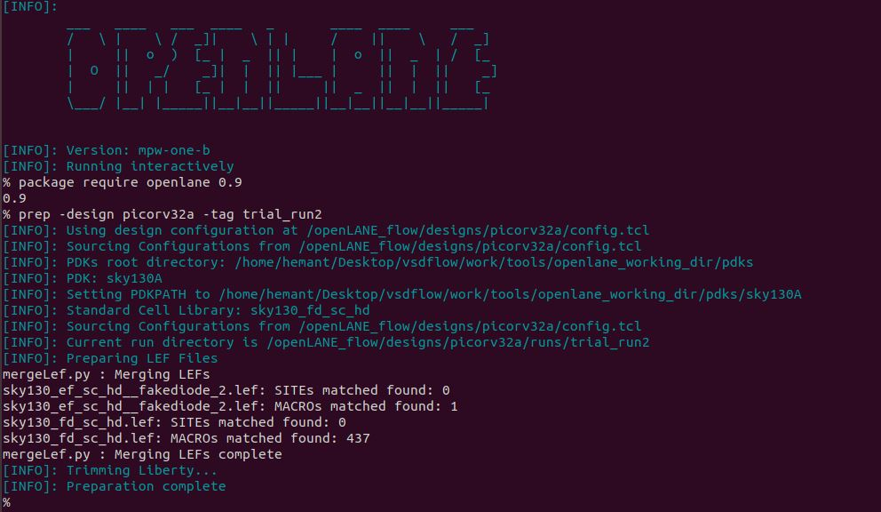  
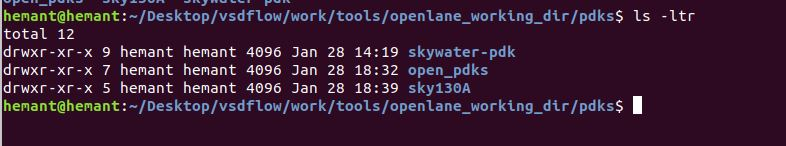 
### Skywater PDK Files

<!-- Day 2 Chip Floorplanning and Standard Cells-->
##  Day 2 Chip Floorplanning and Standard Cells

### Floorplanning
Floorplaing is are basically maintain the balance between performance and area using some components as below
1. Aspect Ratio & Core Utilization Factor
2. Preplaced Cells or MACRO's
3. power planing 
4. pin placement

### 1. Aspect Ratio & Core Utilization Factor
Aspect Ratio is defined the size and the shape of the core by changing the height and width of the core, as Aspect Ratio is 1 this define the chip as square shape. Aspect ratio  is ratio of the height and the width **Aspect ratio = width/height**
Core Utilization Factor is the area occupied by the standard cells.  Its range is around utilization factor 0.5-0.8 and remaining 0.2 that is 20% is kept for routing **Core Utilization = (Standard cell area + macro area ) / Total Core Area**

### 2. Preplaced Cells or MACRO's 
Preplaced cells or MACRO's  have set reserved spots which are blocked from ordinary cells during floor planning.  

### 3. power planning 
Power planning is done along with floor planning to distribute power through the chip uniformly. this can leads to coupling capacitances between the two wires. It is done before the actual signal  routing  and clock routing. 

### 4. Pin Placement
Pin placement is used to find the optimum place to place the I/O pads. so less power is consume .
## Floorplanning 
To run the floorplaning in Openlane 
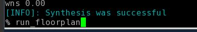  before that to see the Core Utilization Factor

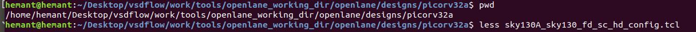  

After run this config file  
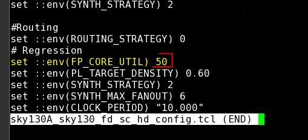  
In this Utilization Factor  is set to 0.5  
If want to check the any value we have to do  `echo` commend and to change the value we have to do the `set` commend.
I this we check the modified the value of `CLOCK_PERIOD`  from 24 to 12  
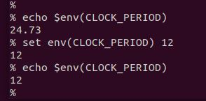  
after completing the `run_floorplan` .def file is produce inside the run floorplan folder inside the run directory   

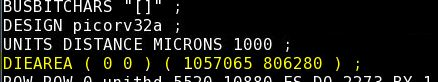 

`UNITS DISTANCE MICRONS 1000` indicates 1 Micron = 1000 data units 
`DIEAREA (0 0) ( 1057065 806280) ` indicate the two coordinates on the die **(LOWER_LEFT_X , LOWER_LEFT_Y) (UPPER_RIGHT_X , UPPER_RIGHT_Y)**.   

### View the Floorplan in Magic 
syntax for viewing the floorpaln in magic `magic -T <magic tech file > lef read < merged lef file > def read < floorplan  def file >`
magic technology file (sky130A.tech)
merged lef from the preparation stage (merged.lef)
floorplan def file (picorv32a.floorplan.def)
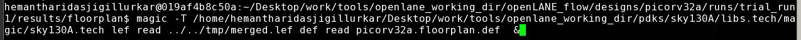 
this open the floorplan def file 
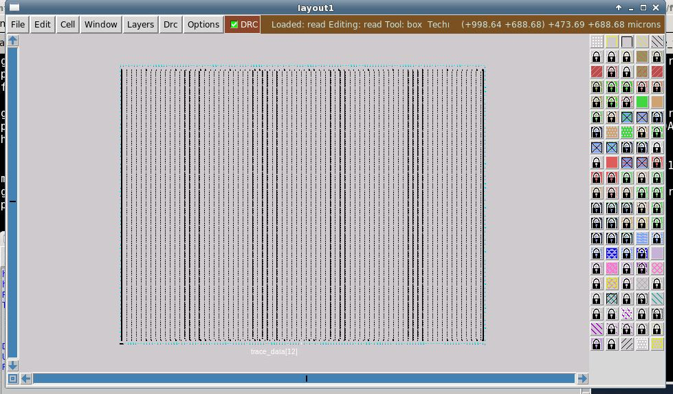 
### Placement 
Placement is done in two stage 1. Global Placement  2.Local Placement  
to run the placement `run_placement`   
placement report  
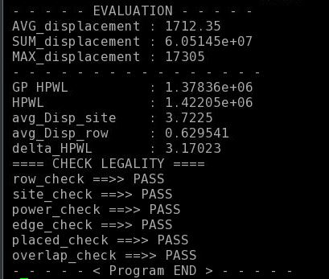  
 syntax for viewing the floorpaln in magic `magic -T <magic tech file > lef read < merged lef file > def read < placement  def file >`  

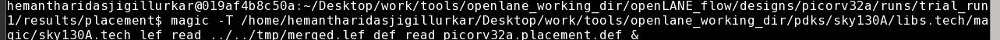

Result in the magic 
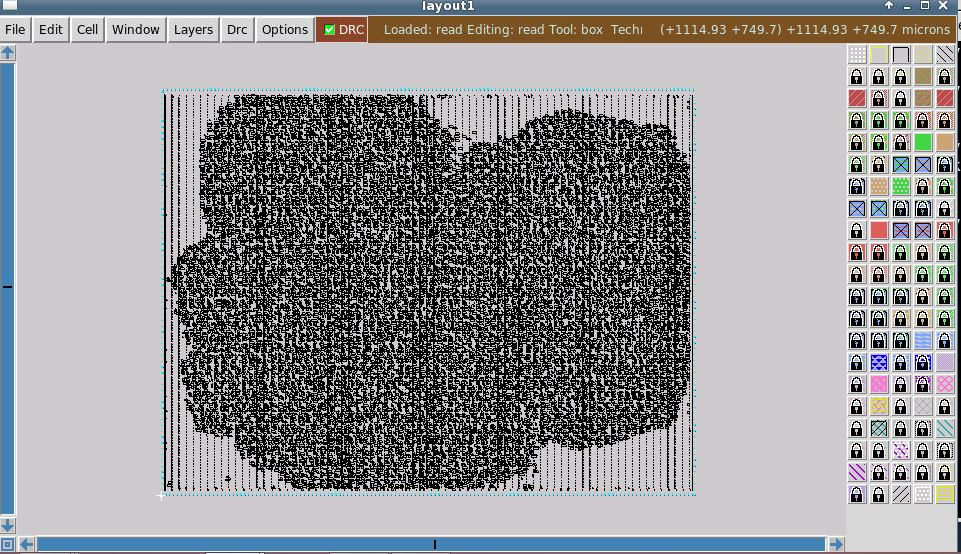

after zooming 
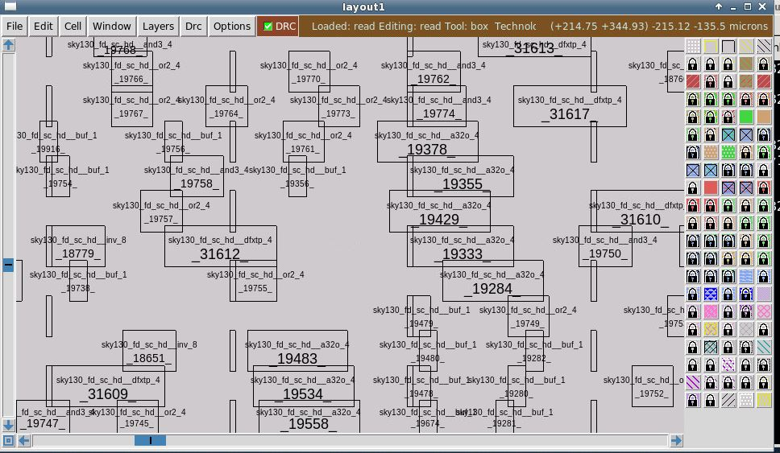
to change the placement of I/O pads `set ::env(FP_IO_MODE) 2` 

 this accumulate the I/O pads in at the distance of 2 as seen in image below  
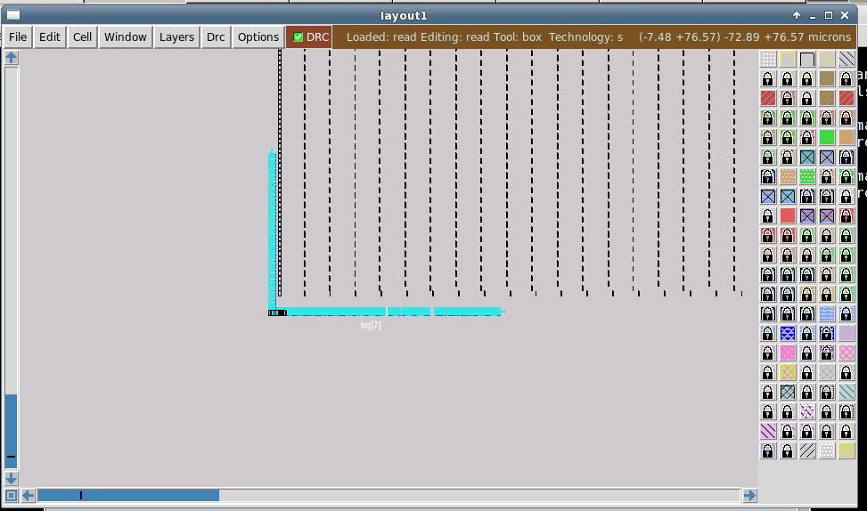


## Day 3 Design library cell  
###  Cloning the design file 
For this we clone the available file of the inverter by the [@nickson jose](https://github.com/nickson-jose) github repository titled ["vsdstdcelldesign"](https://github.com/nickson-jose/vsdstdcelldesign). 
Cloning:  
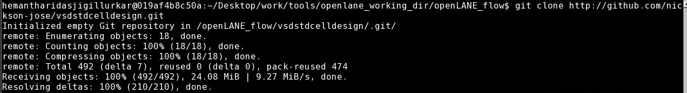  
  
the vsdstdcelldesign directory :    
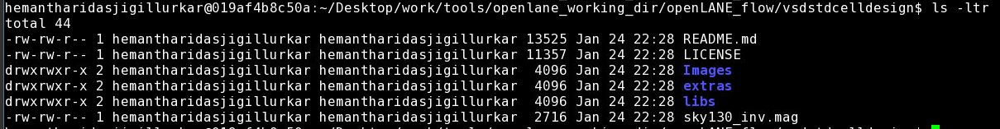  
copying the tech file :
syntax `cp <source > <destination >`  
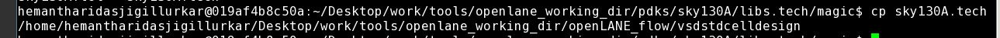 
verifying copying file:
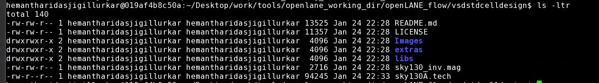  

### Viewing Inverter Standard Cell in Magic 

syntex `magic -T <tech file > <mag file >`  
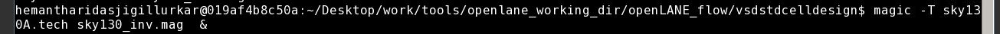  
inverter Layout  
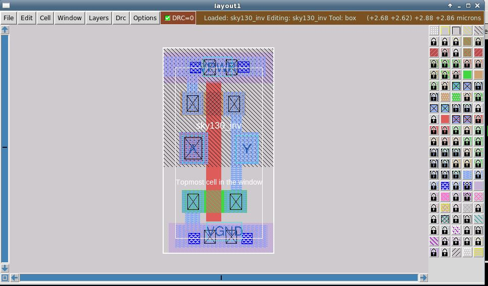


  **see the layers of the device **  
Select the layer of the device of the by place mouse pointer and press `s`  
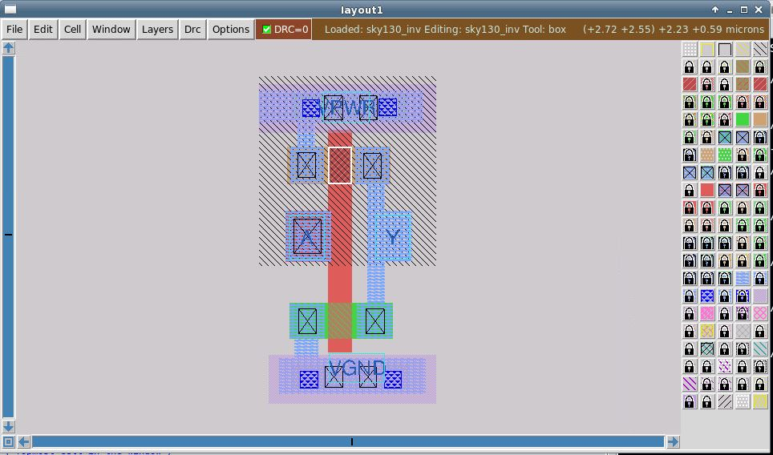  
Run the commend `what` in the tkcon window 
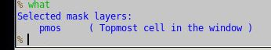
### DRC Errors 
DRC Errors are introduce by adding other layer.  
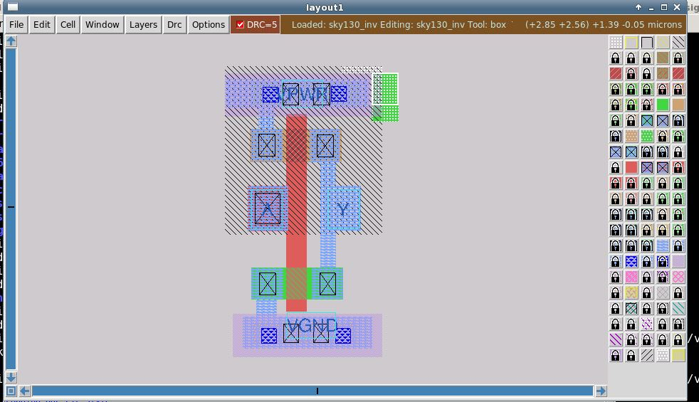  
To see DRC error in the tkcon window 
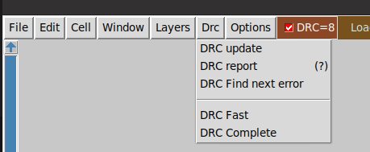  
click on the DRC Find Next Error.  
Error are shown as below in the tkcon window  
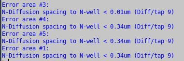   
  ### Parasitic Extraction in Spice file   

Run this commend in the tkcon window 
```
% extract all 
% ext2spice cthresh 0 rthresh 0
% ext2spice 

```  
**changes in the model file**  
Change the spice file include the phot and nshot libraries and replaced the models.

edited spice file is as below:  
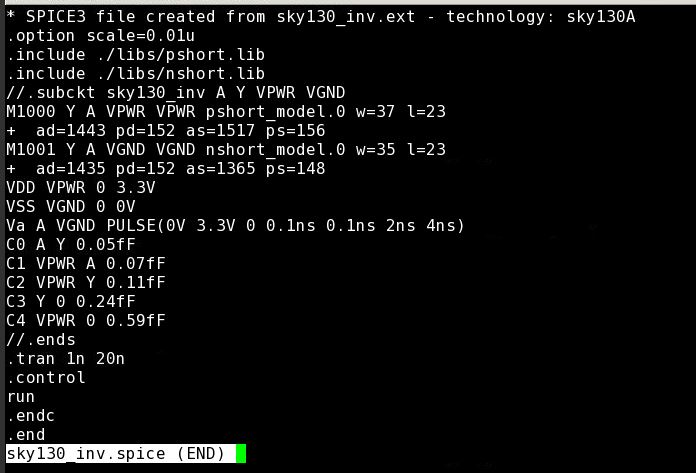   
after that run the spice file using  `ngspice <.spice file>`  

Report  
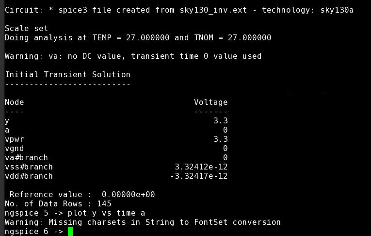  

then Plot the graph by using `plot y vs time a`  
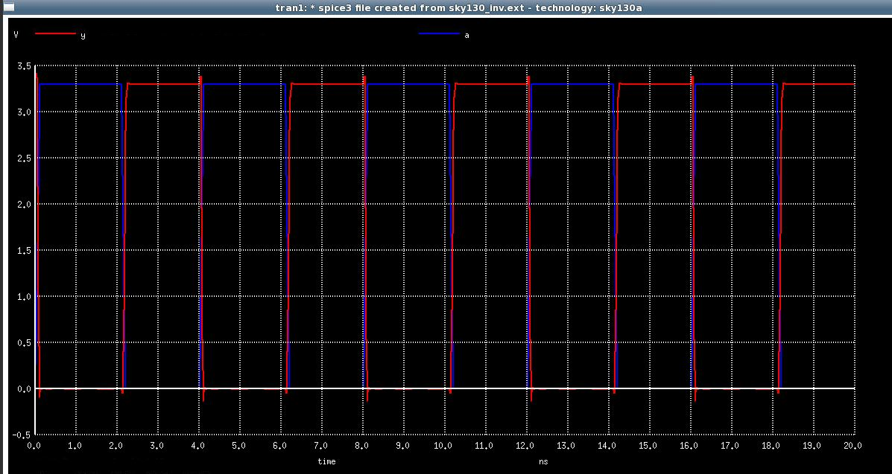   


1. Rise Time - 20% of the Maximum Value  is 3.3V is to be 0.66v and 80% of that value is 2.61V  
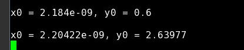   
2. Propogation Delay -50% of the  Maximum Value is to be 1.65V  
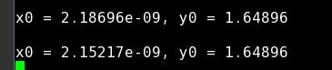   

## Day 4 Pre-Layout Timing Analysis and Clock Tree Synthesis  
Standard cell placement is essential 
to display grid on magic by using `% grid 0.46um 0.34um 0.23um 0.17um` on tkcon window  
to define port in magic using GUI Magic click `Edit -> Text` . and enter the details as follows.  
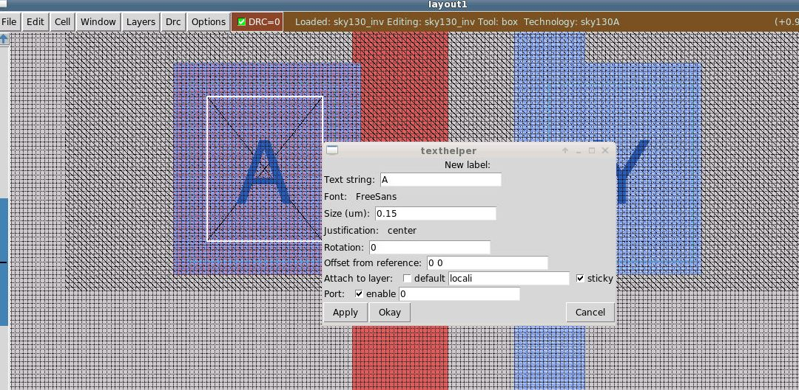   
port also setup using tkcon window using the `class` and `use` atributes   
```  
port class inout 
port use power  //for VPWR  
port class input 
port use signal //for A 
port class output 
port use signal //for Y
port class inout 
port use ground //for VGND  
```

### Generation of Lef file   
Magic generate both lef ang meg file to save the file as meg  use the `save` 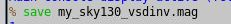 this save the my_sky130_vsdinv.mag    
to generate the lef file use the `lef  write` 
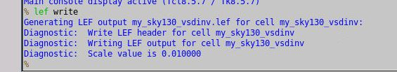   
name of lef file is same as the `. mag` file 
 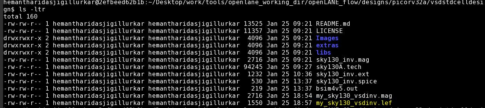   

to include the cell in to design changes to be done in config.tcl file   
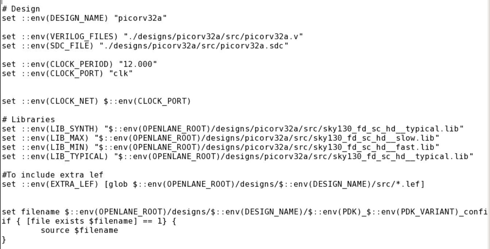   
then re run the Openlane `./flow.tcl -interactive -> package require openlane 0.9`   
then Run the `prep -design <design_name> -tag <tag_name> -overwrite` 

ones we change in config.tcl we need to use `- overwrite`   
and include some lef files in the flow
`set lefs [glob $::env(DESIGN_DIR)/src/*.lef]`  
`add_lefs -src $lefs`  
  
Run the synthesis `run_syntesis`   
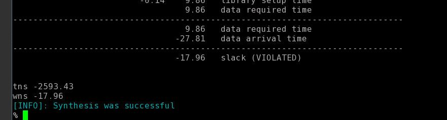 

fixing some Violations 
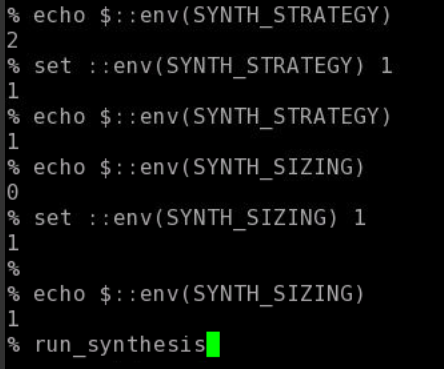

using thisviolations is redues  to 5.36 from 17.96     
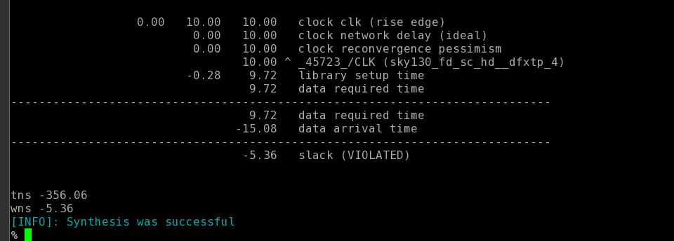   

chip is area of is      
we run the sta to generate the time analysis `sta pre_sta.conf` 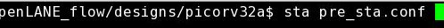   

### upsizing buffers 
after  upsizing some buffers the area is increase Violations are reduces   
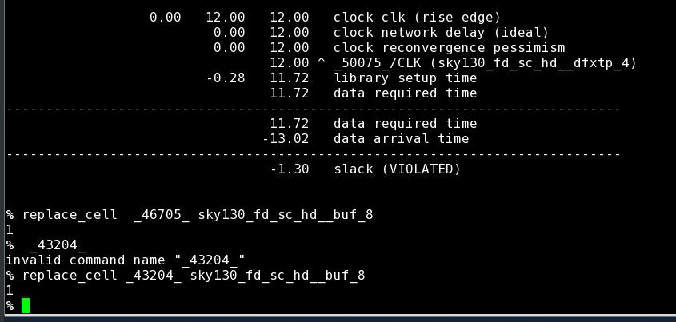   

observing the report using    
the finally the export the verilog file to the synthesis folder   

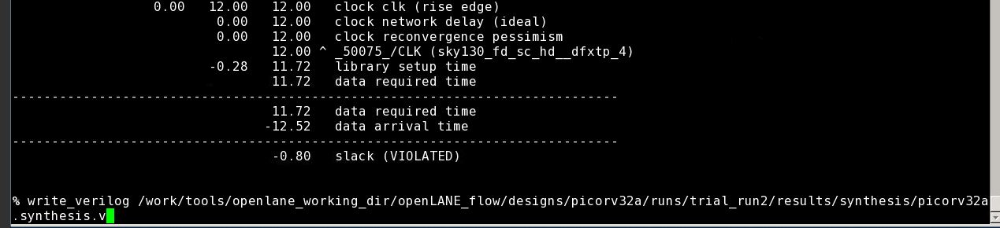


### Clock Tree Synthesis  
Run the using `run_cts` commend  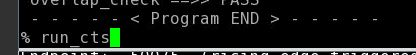   

### Using OpenROAD  
run `openroad` and execute the following commends 

```  
% write_db pico_cts.db
% read_db pico_cts.db
% read_lef <Location_of_LEF_file> //Location of LEF file - /designs/picorv32a/runs/<tag_name>/tmp/merged.lef
% read_def <Location_of_DEF_file> //Location of DEF file - /designs/picorv32a/runs/<tag_name>/results/cts/picorv23a.cts.def
% read_verilog <Location_of_verilog_file> //Verilog file - /designs/picorv32a/runs/<tag_name>/results/synthesis/picorv32a.synthesis_cts.v
% read_liberty $::env(LIB_SYNTH_COMPLETE)
% link_design <design_name> //design name = picorv32a
% read_sdc <Location_of_sdc_file> //sdc file - /designs/picorv32a/runs/<tag_name>/src/my_base.sdc
% set_propagated_clock [all_clocks]
% report_checks -path_delay min_max -fields {slew trans net cap input_pin} -format full_clock_expanded -digits 4

```
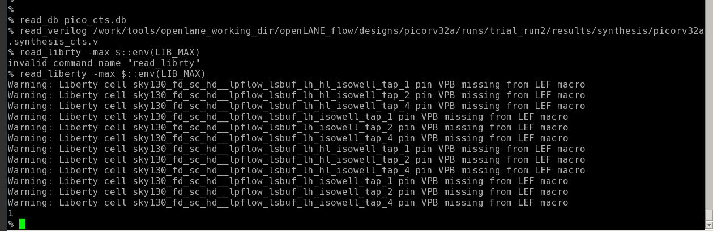

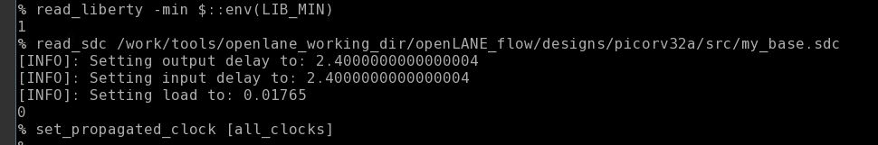


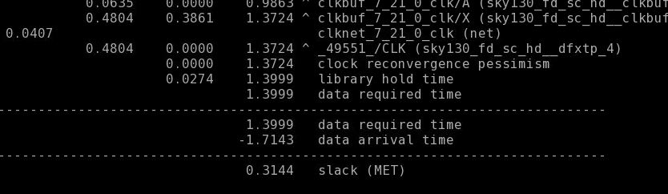
  

## Day 5  Final steps for RTL2GDSII

to verify which part of the flow we are in we use `echo $::env(CURRENT_DEF)` 

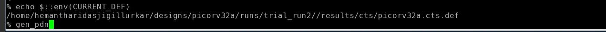  

###power distribution network stage   
`gen_pdn`  
after run this   
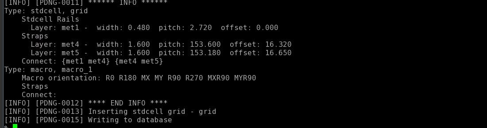  
for this workshop we use Routing Strategy 0. One can understand which strategy is put into place by executing % echo $::env(ROUTING_STRATEGY) in OpenLANE. By default, OpenLANE executes strategy 0.

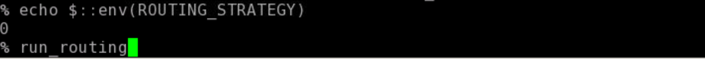  

### SPEF Extraction  
Once the routing is completed, the interconnect parasitics are extracted to perform sign off Post-STA analysis. These parasitics are extracted into a SPEF file.   
The SPEF EXTRACTOR tools has been made available in the `home/<user_name>/Desktop/work/tools` directory. Once we're in the directory, we're to execute the python file main.py by passing 2 main arguments:  
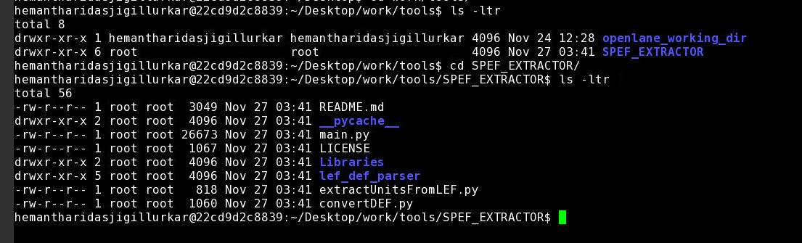  
final command to generate - `python3 main.py /designs/picorv32a/runs/<tag_name>/tmp/merged.lef /designs/picorv32a/runs/<tag_name>/results/routing/picorv32a.def`    
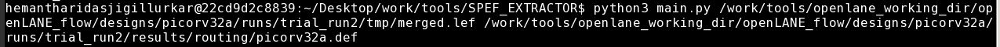  
The SPEF file is then written into the routing directory under <tag_name>/results
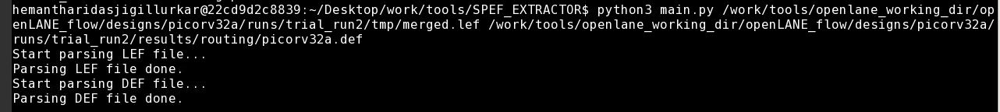  


# Contact #


Hemant Gillurkar - gillurkarhh@rknec.edu

# Acknowledgements #

[Kunal Ghosh - Co-founder (VSD Corp. Pvt. Ltd)](https://github.com/kunalg123)  
[Nickson Jose - VSD VLSI Engineer](https://github.com/nickson-jose)
